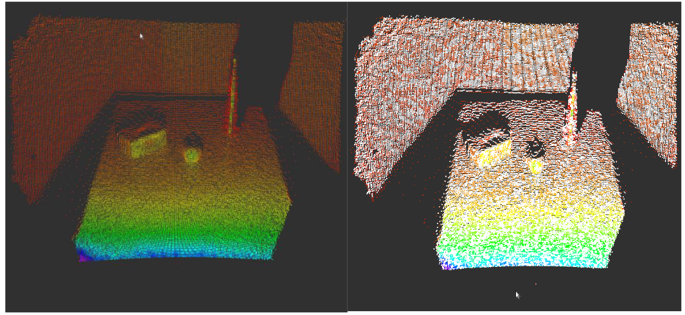
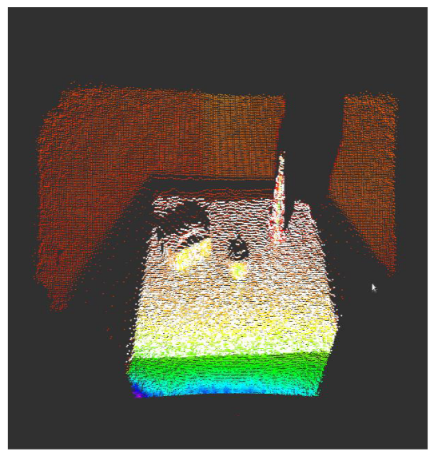
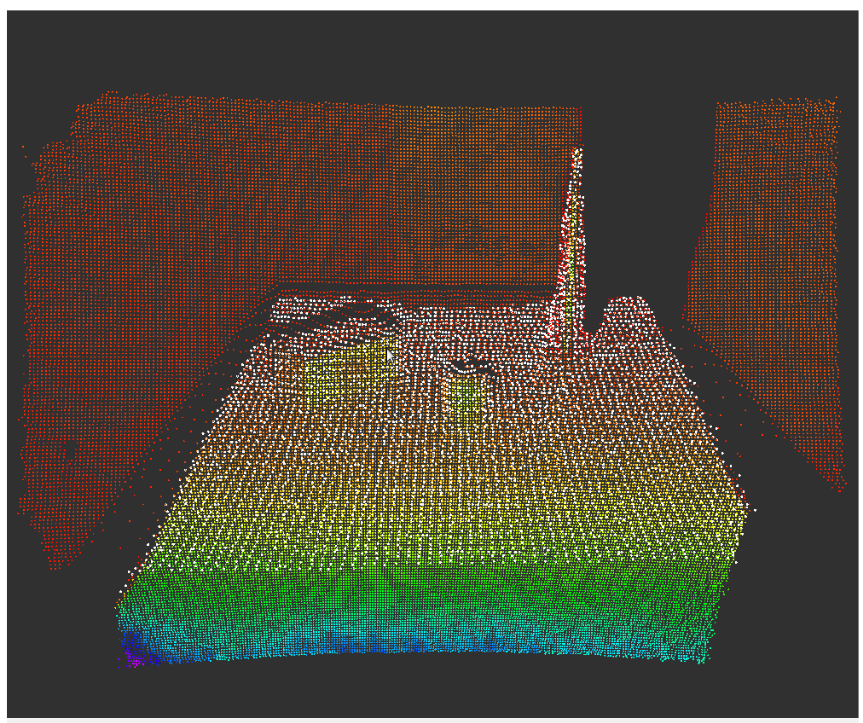
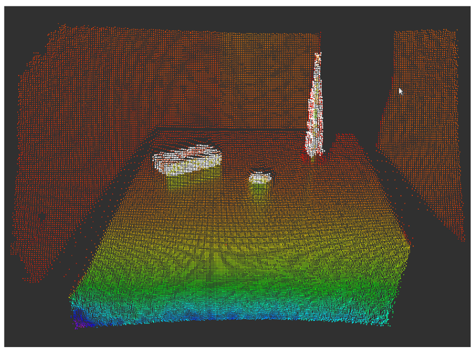
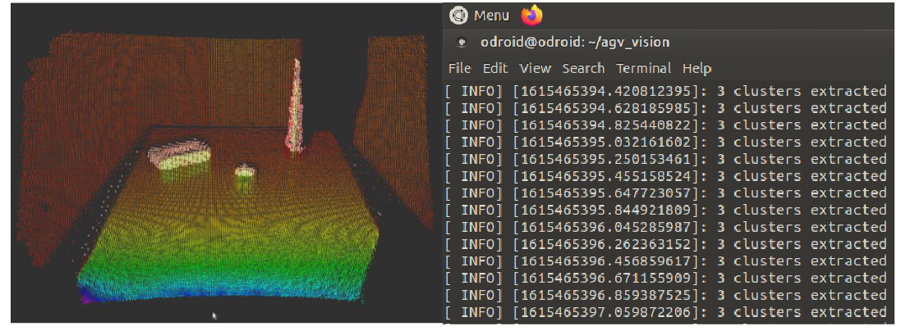
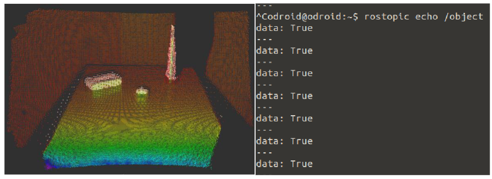
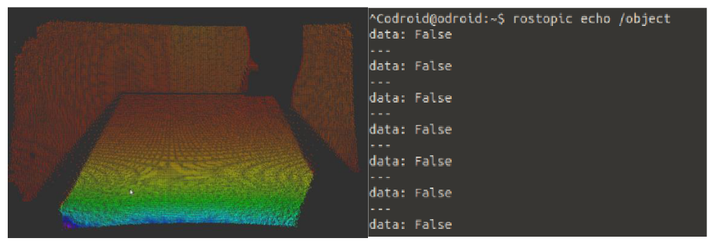

# perception-AGV
ROS package that implements the perception pipeline using point clouds for an autonomous guided vehicle.

The various steps performed here for the processing of raw PointCloud data are:

### Outlier Filtering using Statistical Outlier Removal filter

The raw point clouds that are generated by the 3D cameras often contain stray points which can affect the results
of further calculations that are performed. This could particularly affect processes like the estimation of surface
normals or the calculation of centroids Some of these irregularities can be solved by performing the statistical
analysis on each points neighborhood and trimming those which do not meet a certain criterion.

### Passthrough filtering to crop the cloud

Passthrough filtering is used to crop the point cloud by removing points that lie outside the defined bounds. This
helps us to focus the processing on only the region that is required.

### Voxel Grid filtering

Voxel Grid filtering is used to downsample the pointcloud if it is too dense to reduce the processing load required.
The voxelated grid approach works by dividing the input cloud into a grid of 3D boxes named voxels. The points in
each voxel are approximated by considering the centroid of all the points in the vowel.

### Planar Segmentation

Voxel Grid filtering is used to downsample the pointcloud if it is too dense to reduce the processing load required.
The voxelated grid approach works by dividing the input cloud into a grid of 3D boxes named voxels. The points in
each voxel are approximated by considering the centroid of all the points in the vowel.

### Euclidean Clustering

Clustering is a method of grouping points that are lying close together so that we can separate the different objects
out of a 3D scan and later estimate properties such as the position of these objects in 3D space. To optimize the
process a search algorithm such as KD Tree is used. This helps the program know which points are close to each
other. For the actual algorithm of Euclidean clustering a point that has not been previously selected is taken and its
neighbors are determined using the KD Tree. Each of these points are then checked for a predefined proximity (i.e.,
if they are less than a certain distance) from the point and if they are, the point is added to the cluster. The proximity
check is then recursively called on the neighboring points of this point as well. A minimum cluster size is defined to
avoid the clustering of stray points.

### Obstacle detection

For a line follower mechanism, the most important requirement of a vision sensor is to be able to tell if an obstacle
is present or not, for the robot to stop. This can be done in the clustering step itself. A Boolean variable is used which
is set to false at the beginning of the processing step and then changed to true if the size of the cluster array is
greater than zero. This Boolean variable is published on a different topic from the one of the output clouds. A
subscriber to this separate topic can be used to send messages regarding the presence of obstacles to the controlling
computer.

